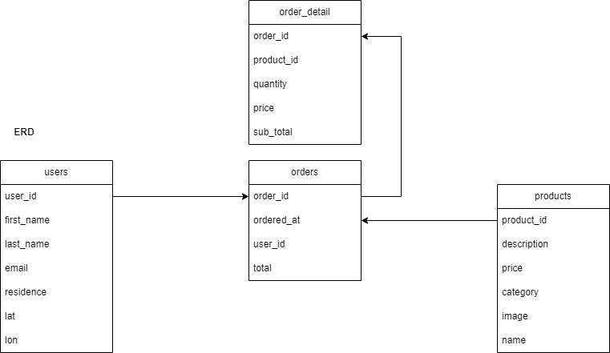
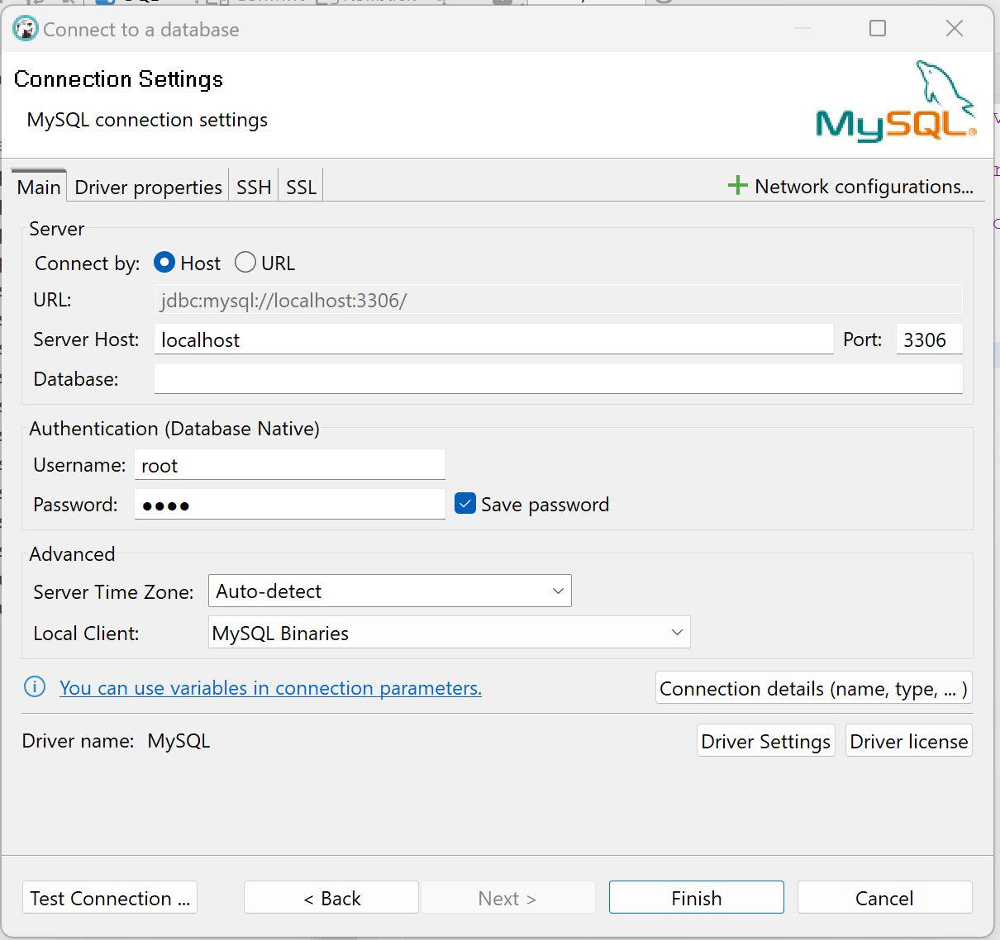
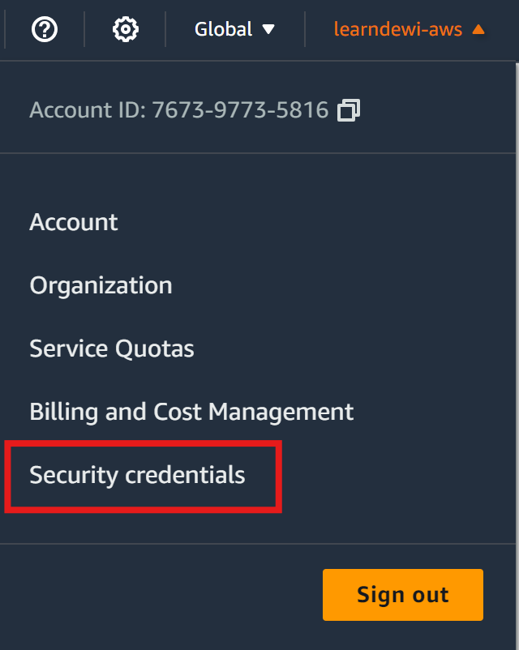
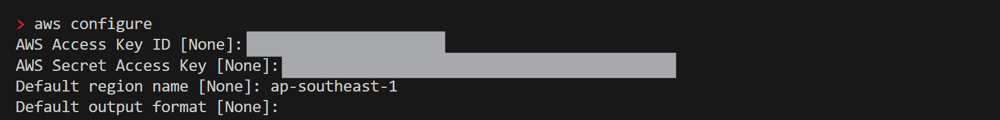
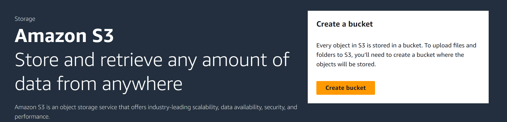
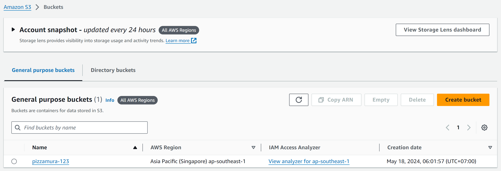
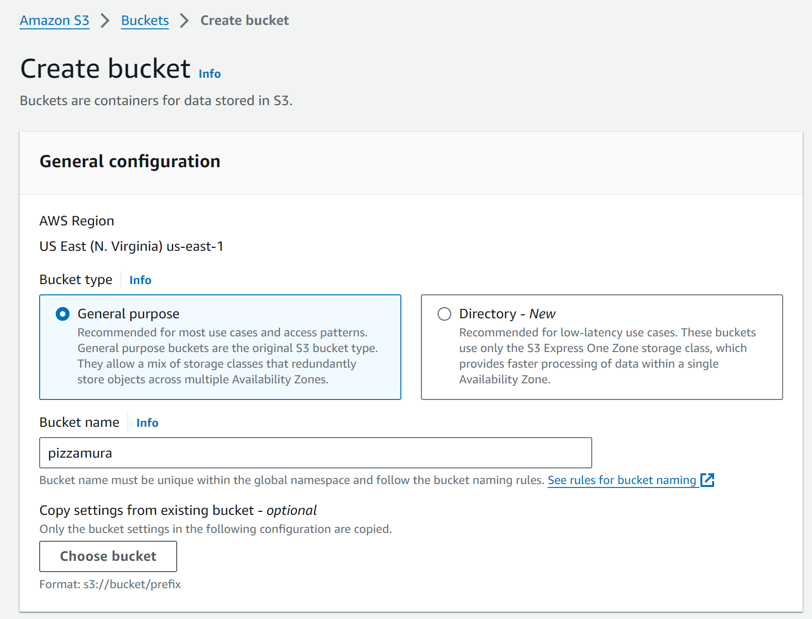
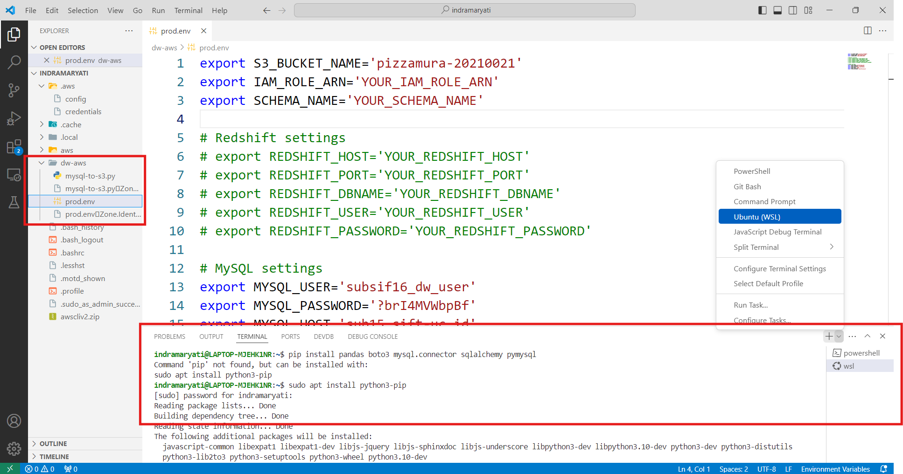
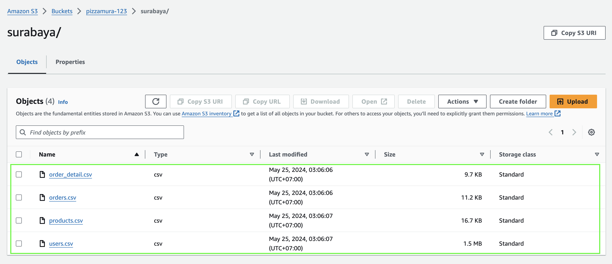

# Building a Data Warehouse System
## Case Study

Mr. James is the owner of a pizza kiosk brand called "Pizzamura," which has hundreds of franchise kiosks in many cities across Indonesia. Mr. James has been using a PoS (Point of Sales) application to record daily sales transactions, manage inventory, and store customer data. To reduce complexity, customer data, orders, and inventory are stored in local databases at each kiosk.

One day, amid the hustle and bustle at the "Pizzamura" headquarters, Mr. James sat at his desk, reviewing transaction reports from several franchise kiosks. His face looked worried because the data he had was scattered across various locations, separated at each kiosk. He realized how important it was to have a single, centralized data source. That's when Mr. James decided to build a Data Warehouse.

With a Data Warehouse, Mr. James would have better visibility over his entire business operations. He could integrate data from all his kiosks into one place, making it easier to analyze sales performance, monitor inventory, and understand customer behavior across the entire "Pizzamura" kiosk network.

Additionally, Mr. James realized that with a Data Warehouse, he could strengthen his business strategy. With quick and easy access to historical sales data, he could identify long-term trends and predict future market demand. This would help him make more accurate decisions and improve operational efficiency.

Moreover, Mr. James understood that with a Data Warehouse, he could enhance the customer experience. By gaining deeper insights into customer data, he could better understand customer preferences, tailor promotions and special offers, and improve overall customer service.

Let's help Mr. James take "Pizzamura" to a higher and more sustainable level in the pizza industry by building a Data Warehouse.

### Metrics

- **Daily/Weekly/Monthly Sales:** 
Provides information on total sales over various time periods, helping Mr. James track sales performance over time.

- **Average Order Value:** 
Shows the average value of orders placed by customers, aiding in planning promotions or special offer packages.

- **Customer Purchase Frequency:** 
Provides insights into how often customers return to order, helping identify loyal customers and develop loyalty programs.

- **Best-Selling Items Analysis:** 
Identifies the most frequently sold items or menu items, enabling Mr. James to make better stock and promotional decisions.


## Problem Solving

ERD



Proposed Data Warehouse


Github link: https://github.com/oktavianidewi/pm2024-uc-dwh 

### Tools
1. [MySql](https://dev.mysql.com/downloads/workbench/)
2. [DBeaver](https://dbeaver.io/download/) or [Phpmyadmin](https://www.phpmyadmin.net/) or [Adminer](https://www.adminer.org/)
3. [Docker](https://www.docker.com/products/docker-desktop/) (if you have already familiar with)
4. [Python](https://www.python.org/) version > 3.9
5. [AWS Command Line Interface (CLI)](https://docs.aws.amazon.com/cli/latest/userguide/getting-started-install.html)
    
### Steps
#### 1. Install and connect dashboard (DBeaver) to access MySQL



#### 2. Feed data `products`, `users`, `orders`, `order_detail` to MySQL

via DBeaver, PhpMyAdmin or Adminer, copy and execute these SQL script: 
- [DDL create table](./sql/ddl_tables.sql)
- [insert products](./sql/products.sql)
- [insert users](./sql/users.sql)
- [insert orders](./sql/orders.sql)
- [insert order_detail](./sql/order_detail.sql)

#### 3. Ingest data from MySQL to AWS S3 with Python

##### Pre-requisites

- If your OS is Windows, please install WSL first. WSL is designed to allow developers and system administrators to run a GNU/Linux environment directly on Windows, without the need for a virtual machine or dual-boot setup. Follow the guide [here](https://learn.microsoft.com/en-us/windows/wsl/install). 
    - If you encounter this error: `WslRegisterDistribution failed with error: 0x8004032d`, ) typically it indicates that WSL might not be properly enabled on your system. To solve this problem, you have to ensure that WSL is enabled [here](https://learn.microsoft.com/en-us/answers/questions/1424692/how-to-fix-wslregisterdistribution-failed-with-err).

- While using macOS, you can rest assured


##### a. Configure AWS CLI

- If you're a WSL user, install AWS CLI using this command:
    ```
        curl "https://awscli.amazonaws.com/awscli-exe-linux-x86_64.zip" -o "awscliv2.zip"
        sudo apt install unzip
        unzip awscliv2.zip
        sudo ./aws/install
        which aws
    ```
- For macOS user, install using this command: 
    ```
        brew install awscli
    ```

- After the installation is complete, let's configure our AWS account to AWS CLI. On AWS dashboard:


- Create security credential info or download csv file. 
- Configure on our AWS CLI
    ```
        # configure aws profile via import https://docs.aws.amazon.com/cli/latest/userguide/cli-configure-quickstart.html
        aws configure import --csv ~/Documents/keys/dewi_aws_credentials.csv 

        # or manually via: 
        aws configure
    
    ```


- Change our zone to Singapore (`ap-southeast-1`) 


- Go to AWS S3 service, then Create S3 Bucket







##### b. Install Python

- To execute the ingestion code, we need to install Python on our OS (WSL/macOS).
- To install Python on WSL, follow along these steps: 
    ```
    sudo apt-get update
    sudo apt-get install build-essential zlib1g-dev libffi-dev libssl-dev libbz2-dev libreadline-dev libsqlite3-dev liblzma-dev python3.10
    ```
- Once the python and the required libraries are installed, check the installed python version with this command.
    ```
    python --version
    or
    python3 --version
    ```
 - Open IDE for viewing the ingestion python code, using this commmand will open VSCode.
    ```
    code .
    ```
- Ingestion code can be read [here](./mysql-to-s3.py). Download the file.
- Also download [prod.env](./prod.env)
- In VSCode, create a new folder then add [mysql-to-s3.py](./mysql-to-s3.py) and [prod.env](./prod.env) to it.
  
- From VSCode terminal (make sure ubuntu/WSL), Install these python libraries
    ```
    sudo apt install python3-pip
    pip install pandas boto3 mysql.connector sqlalchemy pymysql
    ```
- Update the [prod.env](./prod.env), modify these varibles to your own config name.
    ```
    export S3_BUCKET_NAME='YOUR_S3_BUCKET_NAME'
    
    export MYSQL_USER='YOUR_MYSQL_USER'
    export MYSQL_PASSWORD='YOUR_MYSQL_PASSWORD'
    export MYSQL_HOST='YOUR_MYSQL_HOST'
    export MYSQL_PORT='YOUR_MYSQL_PORT'
    export MYSQL_DATABASE='YOUR_MYSQL_DATABASE'
    ```
    
- Change the directory into our created folder.
    ```
    cd dw-aws
    ```
- Run ingestion code with this command
    ```
    source prod.env && python mysql-to-s3.py
    or
    source prod.env && python3 mysql-to-s3.py
    ```
- Navigate to your AWS S3 bucket. If your code executed correctly, you will see your files have been uploaded.
    
