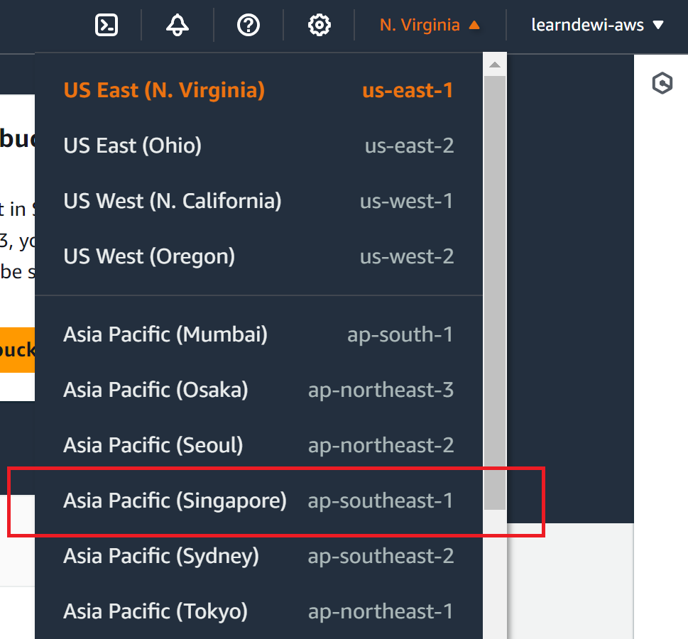

# Building a Data Warehouse System
## Case Study

Mr. James is the owner of a pizza kiosk brand called "Pizzamura," which has hundreds of franchise kiosks in many cities across Indonesia. Mr. James has been using a PoS (Point of Sales) application to record daily sales transactions, manage inventory, and store customer data. To reduce complexity, customer data, orders, and inventory are stored in local databases at each kiosk.

One day, amid the hustle and bustle at the "Pizzamura" headquarters, Mr. James sat at his desk, reviewing transaction reports from several franchise kiosks. His face looked worried because the data he had was scattered across various locations, separated at each kiosk. He realized how important it was to have a single, centralized data source. That's when Mr. James decided to build a Data Warehouse.

With a Data Warehouse, Mr. James would have better visibility over his entire business operations. He could integrate data from all his kiosks into one place, making it easier to analyze sales performance, monitor inventory, and understand customer behavior across the entire "Pizzamura" kiosk network.

Additionally, Mr. James realized that with a Data Warehouse, he could strengthen his business strategy. With quick and easy access to historical sales data, he could identify long-term trends and predict future market demand. This would help him make more accurate decisions and improve operational efficiency.

Moreover, Mr. James understood that with a Data Warehouse, he could enhance the customer experience. By gaining deeper insights into customer data, he could better understand customer preferences, tailor promotions and special offers, and improve overall customer service.

Let's help Mr. James take "Pizzamura" to a higher and more sustainable level in the pizza industry by building a Data Warehouse.

### Metrics

**Daily/Weekly/Monthly Sales:** Provides information on total sales over various time periods, helping Mr. James track sales performance over time.
**Average Order Value:** Shows the average value of orders placed by customers, aiding in planning promotions or special offer packages.
**Customer Purchase Frequency:** Provides insights into how often customers return to order, helping identify loyal customers and develop loyalty programs.
**Best-Selling Items Analysis:** Identifies the most frequently sold items or menu items, enabling Mr. James to make better stock and promotional decisions.


## Problem Solving

ERD

[ERD](./img/ERD.jpg)

Proposed Data Warehouse

[design-dwh](./img/design-dwh.jpg)

Github link: https://github.com/oktavianidewi/pm2024-uc-dwh 

### Tools
1. [MySql](https://dev.mysql.com/downloads/workbench/)
2. [DBeaver](https://dbeaver.io/download/) or [Phpmyadmin](https://www.phpmyadmin.net/) or [Adminer](https://www.adminer.org/)
3. [Docker](https://www.docker.com/products/docker-desktop/) (if you have already familiar with)
4. [Python](https://www.python.org/) version > 3.9
5. [AWS Command Line Interface (CLI)](https://docs.aws.amazon.com/cli/latest/userguide/getting-started-install.html)
    
### Steps
#### 1. Install and connect dashboard (DBeaver) to access MySQL


#### 2. Feed data `products`, `users`, `orders`, `order_detail` to MySQL

via DBeaver, PhpMyAdmin or Adminer, copy and execute these SQL script: 
- [DDL create table](./sql/ddl_tables.sql)
- [insert products](./sql/products.sql)
- [insert users](./sql/users.sql)
- [insert orders](./sql/orders.sql)
- [insert order_detail](./sql/order_detail.sql)

#### 3. Ingest data from MySQL to AWS S3 with Python

- Ingestion code can be read [here](./mysql-to-s3.py)
- Install these python libraries
    ```
    pip install pandas
    pip install boto3
    pip install mysql.connector
    pip install sqlalchemy
    pip install pymysql
    ```

- Install AWS CLI
    ```
        curl "https://awscli.amazonaws.com/awscli-exe-linux-x86_64.zip" -o "awscliv2.zip"
        sudo apt install unzip
        unzip awscliv2.zip
        sudo ./aws/install
        which aws
    ```
- Configure our AWS account to AWS CLI. On AWS dashboard:


- Create security credential info or download csv file. 
- Configure on our AWS CLI
    ```
        # configure aws profile via import https://docs.aws.amazon.com/cli/latest/userguide/cli-configure-quickstart.html
        aws configure import --csv ~/Documents/keys/dewi_aws_credentials.csv 

        # or manually via: 
        aws configure
    
    ```


- Change our zone to Singapore (`ap-southeast-1`) 




- Go to AWS S3 service, then Create S3 Bucket


