# Materi 3

# 1. Upload data from S3 to Redshift

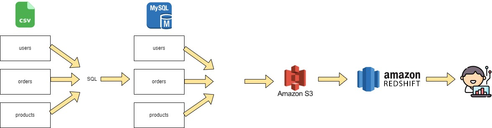

## Step 1: Create an IAM Role Access for Redshift to S3

Creating an IAM role for Amazon Redshift to access Amazon S3 involves several steps. You need to create the IAM role in AWS, attach the necessary policies to grant S3 access, and then associate the IAM role with your Redshift cluster. Here’s a step-by-step guide:

1. **Sign in to the AWS Management Console** and open the IAM console at [https://console.aws.amazon.com/iam/](https://console.aws.amazon.com/iam/).

2. **Create a new role**:
    - Click on **Roles** in the left-hand sidebar. Click on **Create role**.
    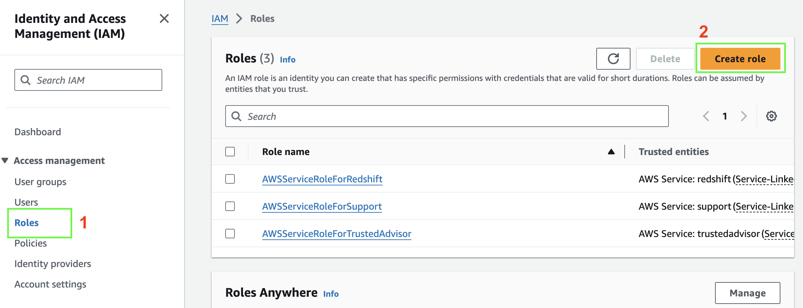
    
    - Select **Redshift** as the trusted entity.
    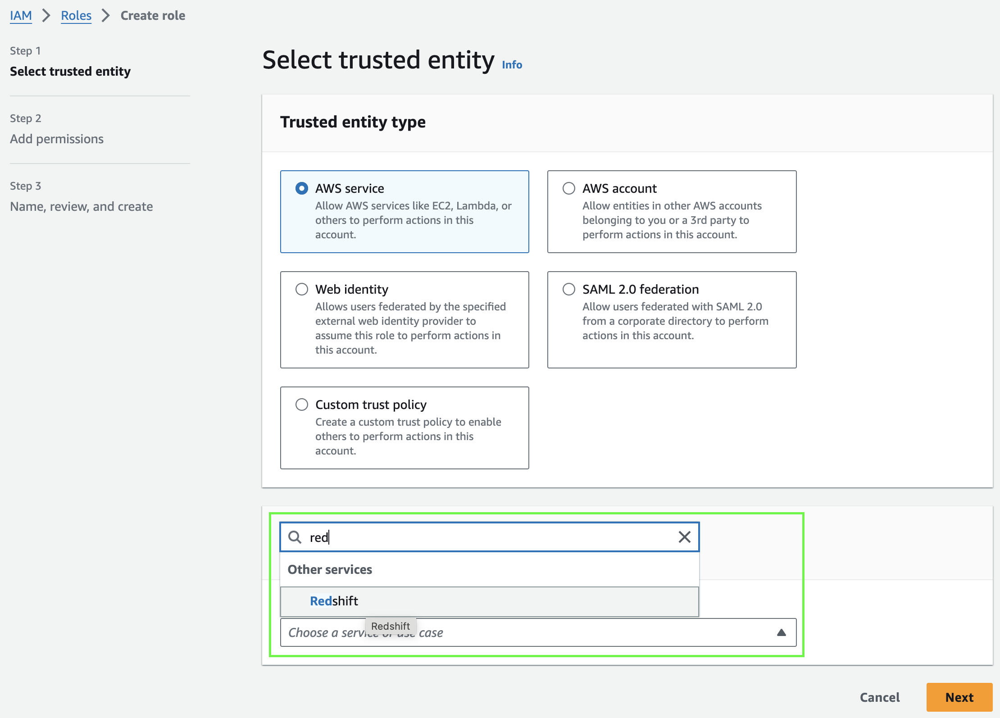

    - Choose **Redshift - Customizable** and click **Next**.

3. **Attach policies**:
    - In the permissions policies, search for and select the policy **AmazonS3FullAccess**. This policy allows Redshift to access S3 with these actions:
        - `s3:ListBucket` - List objects in a bucket.
        - `s3:GetObject` - Retrieve an object from a bucket.
        - `s3:PutObject` - Add an object to a bucket.
        - `s3:DeleteObject` - Delete an object from a bucket.
        - `s3:CreateBucket` - Create a new bucket.
        - `s3:DeleteBucket` - Delete a bucket.
        - `s3:PutBucketPolicy` - Apply a bucket policy.
        - `s3:GetBucketPolicy` - Retrieve the bucket policy.
        - `s3:PutBucketAcl` - Set the Access Control List (ACL) for a bucket.
        - `s3:GetBucketAcl` - Get the ACL of a bucket.
        - `s3:PutBucketLogging` - Set the logging parameters for a bucket.
        - `s3:GetBucketLogging` - Retrieve the logging parameters of a bucket.
    
        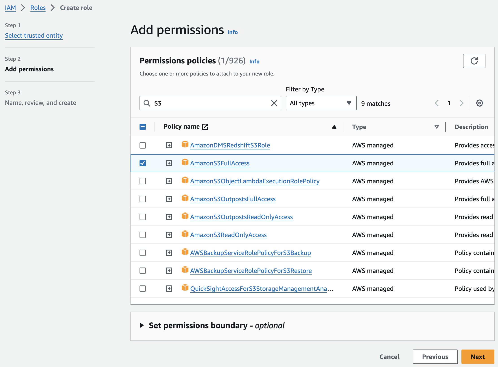

    - Click **Next: Tags**.

4. **Name your role**:
    - Enter a role name, e.g., `redshift-s3-pizzamura`.
    - Review the settings and click **Create role**.
        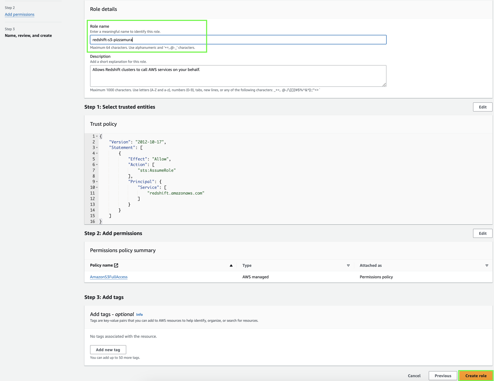
    - IAM role is created
        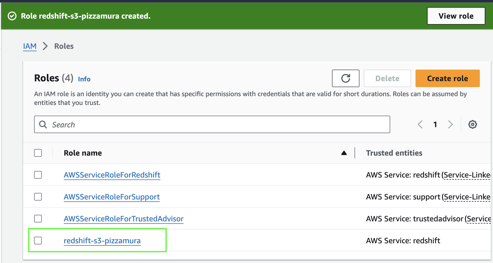


## Step 2: Create A Redshift Cluster 

Amazon Redshift offers a free trial that includes 750 hours of usage per month for two months, along with up to 10 GB of compressed SSD storage. 

1. Open the Amazon Redshift console at [Amazon Redshift Console](https://console.aws.amazon.com/redshift/).

2. Change your region to **ap-southeast-1**. Click on **Create cluster**.

3. **Cluster configuration**:
    - **Cluster identifier**: Enter a unique name for your cluster.
    - **Node type**: Choose `dc2.large` for the Free Tier.
    - **Nodes**: Ensure it is set to `1` to stay within the Free Tier limits.
    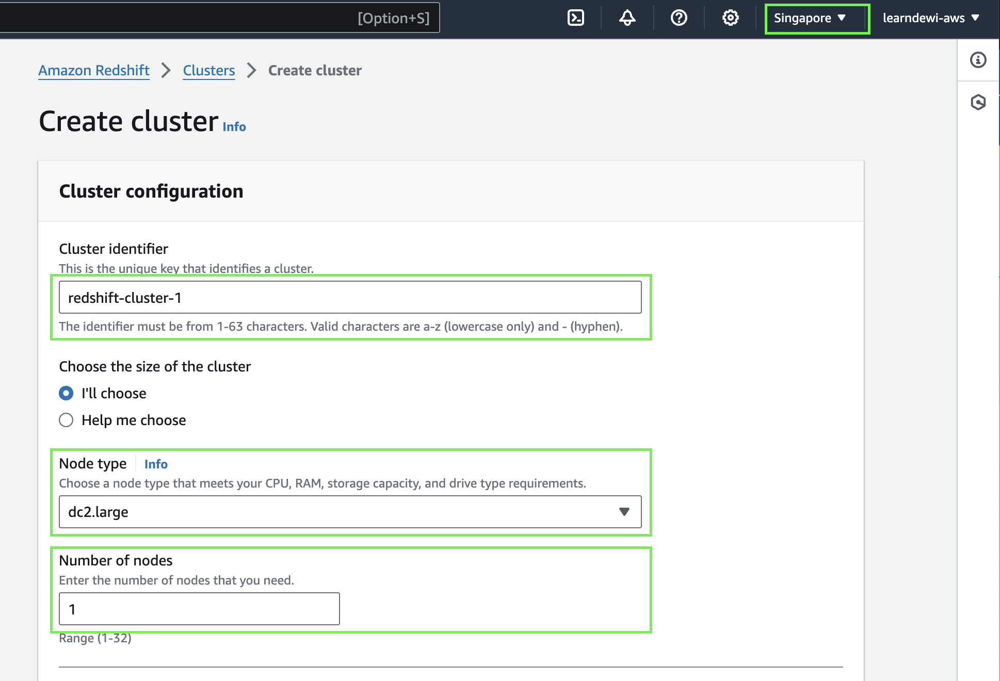

4. **Database configurations**:
    - **Admin user name**: Enter a login ID for the admin user of your DB instance.
    - **Admin password**: Choose the option to manually add the admin password, then set the admin password as per the requirement.
    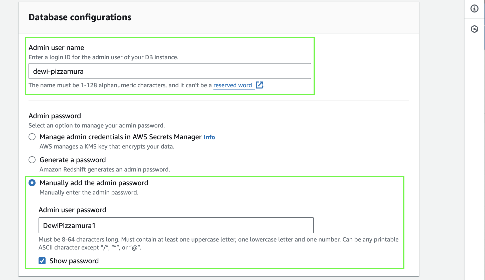

5. **Cluster Permissions**:
    - Choose an IAM role that has the necessary permissions (e.g., access to S3 for data loading).
    - Click **Manage IAM Roles**, then choose **Associate IAM Roles**
    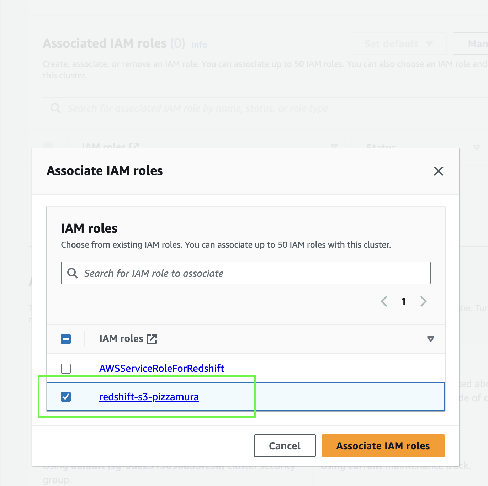

6. **Additional Configurations**:
    - Uncheck the default settings and define the Network and security section ourselves.
    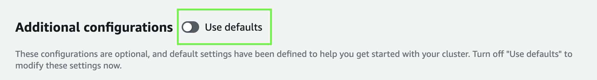

7. **Network and Security**:
    - Turn on **Publicly accessible** button so that we will be able to access our cluster from DBeaver.
    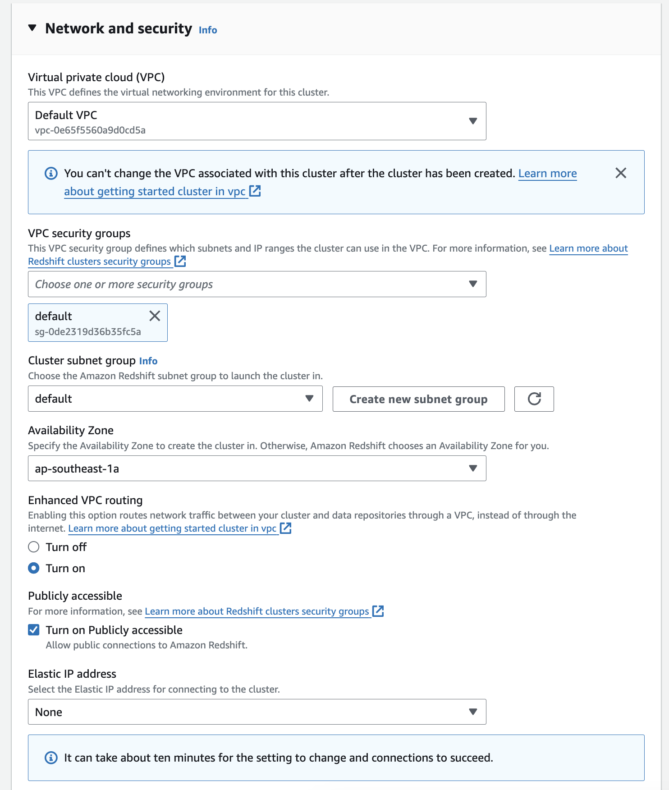
    - If **Cluster subnet group** is empty, then click on **create new subnet group** button. You will redirect into **Create cluster subnet group** window.
    - In **Cluster subnet group details**, leave the **Name** default, then copy the name into **Description**. 
      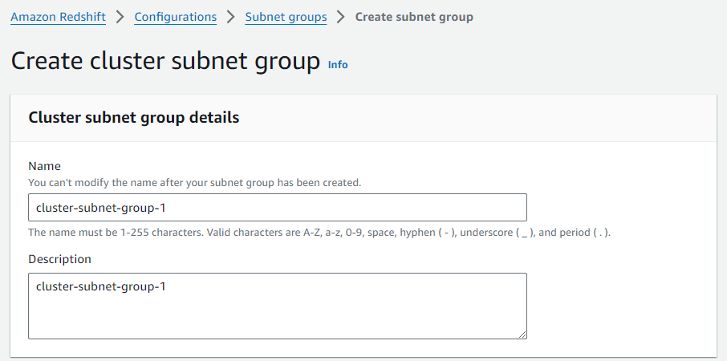
    - In **Add subnets**, choose the available VPC, change Availability Zone into **ap-southeast-1a**, choose available Subnet, then click **Add Subnet** button. For finish setting up, click **Create cluster subnet group** button. 
      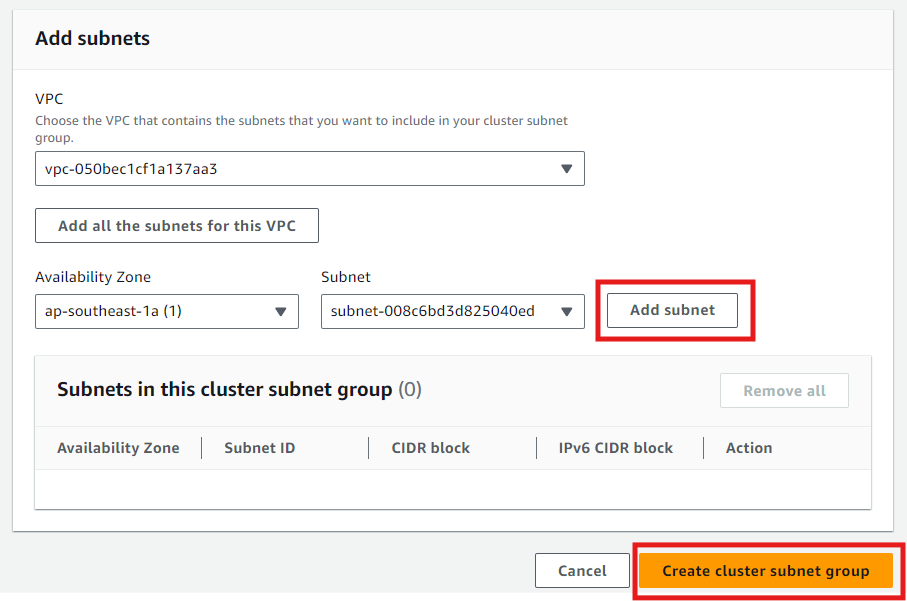

8. **Review and Launch**:
    - Review all your settings. Leave all other options as default.
    - Click **Create cluster**. It will take around 10 minutes to create a cluster.

## Step 3: Configure Security Groups

A security group in AWS acts as a virtual firewall for your instance to control incoming and outgoing traffic. Specifically, inbound rules in a security group control the traffic that is allowed to reach the instance (in this case, an Amazon Redshift cluster) from external sources.
By default, the security settings might be very restrictive to ensure the highest level of security. Ensure your cluster can be accessed by adding inbound rules to the security group associated with our redshift cluster:

1. **Navigate to Redshift Clusters**: In the Amazon Redshift console, click on Clusters in the left-hand navigation pane to view your list of Redshift clusters.
2. Click on the name of the Redshift cluster you want to configure. This will open the cluster details page.
3. Find and select the **Properties** tab to view detailed information about the cluster.
4. In the **Network and security** section of the **Properties** tab, look for the **VPC security groups**.
    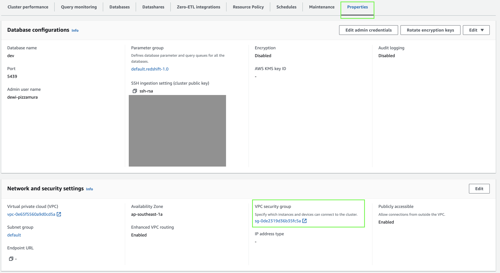

5. Click on the security group link. This will redirect you to the EC2 console where you can configure the security group.
    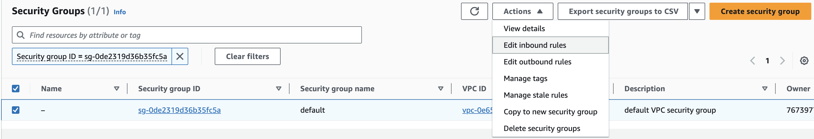

6. **Add a New Inbound Rule:**
    - Click on Add rule.
    - Configure the rule as follows:
        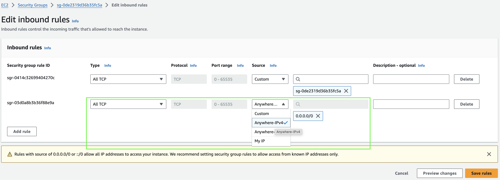
        - **Type**: Select **All TCP** (this will auto-fill the protocol and port range).
        - **Protocol**: auto-fill.
        - **Port range**: auto-fill.
        - **Source**: Choose the IP address or range that should have access:
            - **My IP**: Allows access from your current IP address.
            - **Custom**: Enter a specific IP address or CIDR block (e.g., 203.0.113.0/24).
            - **Anywhere**: Allows access from any IP address (0.0.0.0/0 for IPv4 or ::/0 for IPv6) - not recommended for production due to security risks, just for the learning purpose
7. Click **Save Rule** button

## Step 4: Connect to Your Redshift Cluster (Optional)
1. Use a SQL client like `psql`, DBeaver, or SQL Workbench/J to connect to your Redshift cluster.
    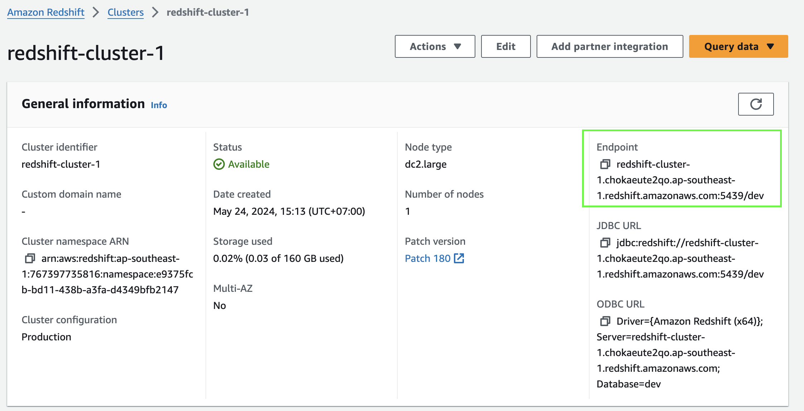

2. Create a new connection to redshift
    

3. To connect, use the master username, password, endpoint, and port of your actual cluster endpoint information. 
    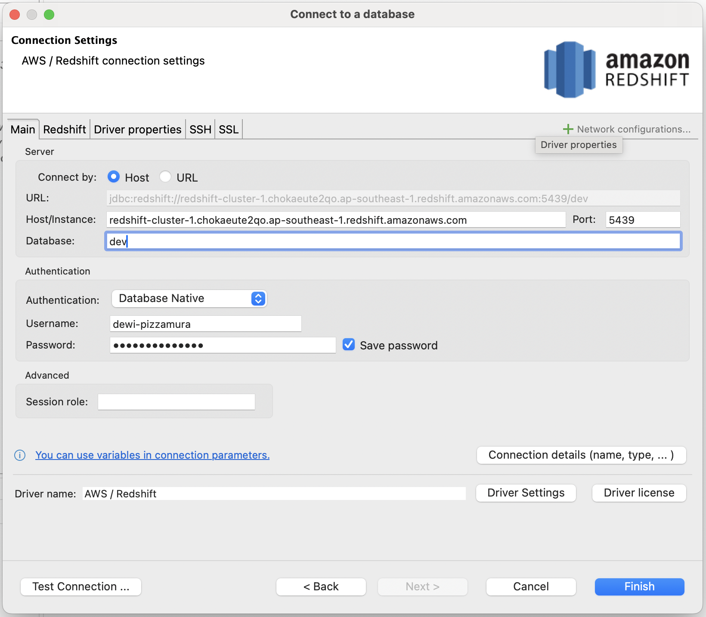

4. Test connection 
    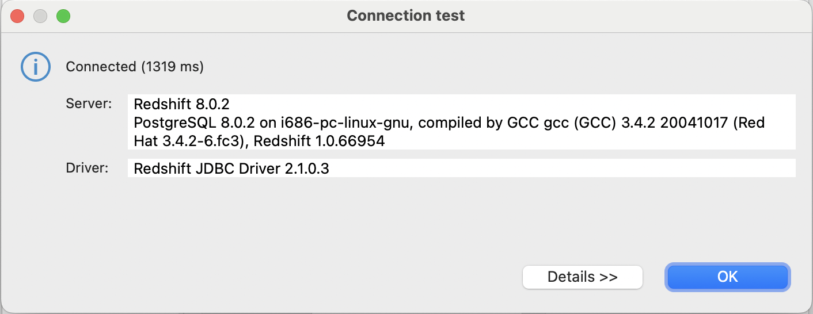

## Step 5: Copy data from S3 to Redshift

1. To copy a CSV file from Amazon S3 to Amazon Redshift, you can use the `COPY` command in Redshift. Here's a step-by-step guide and the corresponding Python code to perform this operation using the `boto3` library and `psycopg2` to interact with Redshift.

    ```
    pip install boto3 psycopg2
    ```

    If that error, try this: 
    ```
    sudo apt install libpq-dev python3-dev
    pip install boto3 psycopg2
    ```
    
2. **Prepare the Redshift Table**. Ensure you have a table in Redshift that matches the schema of your CSV file. 
    a. Open DBeaver (that connect to redshift) or **Query editor on redshift** (see image below)
        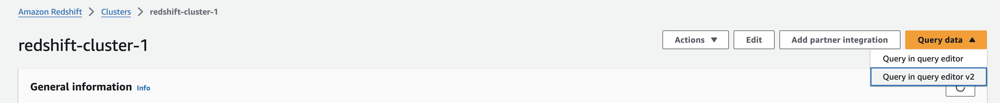

    b. If use Query editor on redshift, click the cluster name then you will ask several option to connect to the redshiftDB. Choose **Temporary credentials using a database user name** and fill the user name with user name in step 2, point 4.
        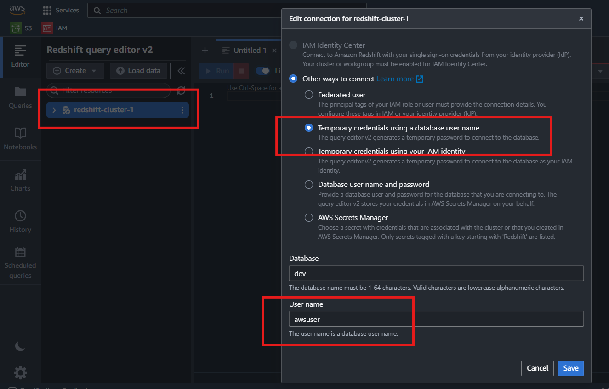
    
    c. Execute [this query](./sql/ddl_tables_redshift.sql) to create tables in Redshift
        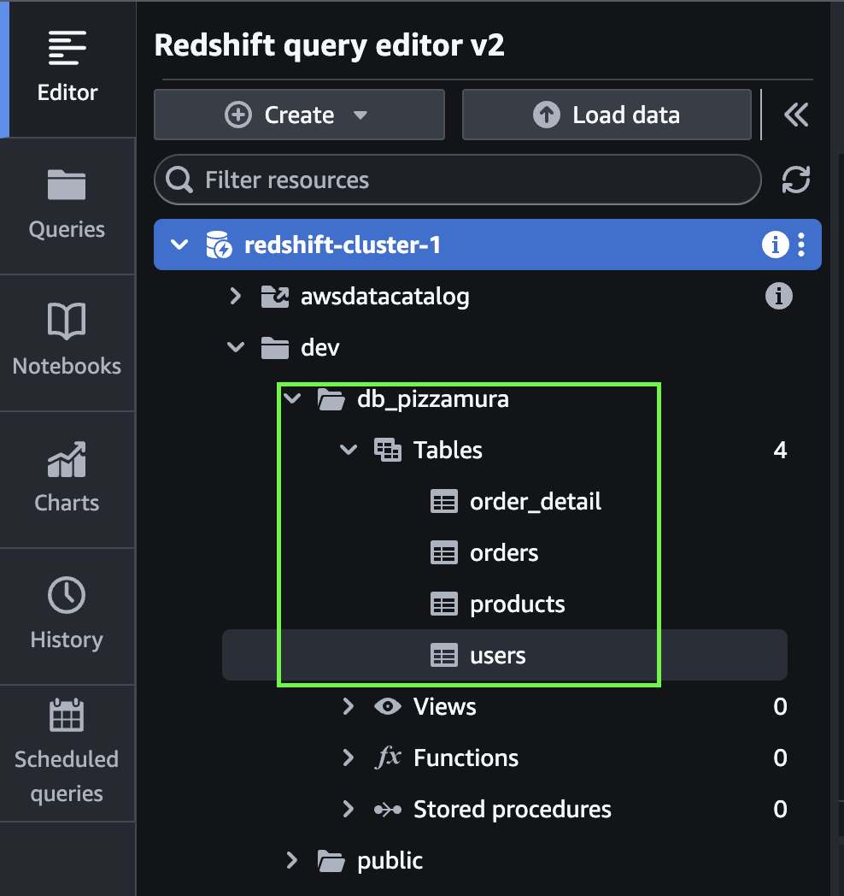

3. Before move S3 to Redshift, modify file [prod.env](./prod.env) the redshift configuration as your actual cluster endpoint information.

    ```
    export S3_BUCKET_NAME='YOUR_S3_BUCKET_NAME'
    export IAM_ROLE_ARN='YOUR_IAM_ROLE_ARN'
    export SCHEMA_NAME='YOUR_SCHEMA_NAME'

    export REDSHIFT_HOST='YOUR_REDSHIFT_HOST'
    export REDSHIFT_PORT='YOUR_REDSHIFT_PORT'
    export REDSHIFT_DBNAME='YOUR_REDSHIFT_DBNAME'
    export REDSHIFT_USER='YOUR_REDSHIFT_USER'
    export REDSHIFT_PASSWORD='YOUR_REDSHIFT_PASSWORD'
    ```
    a. For `S3_BUCKET_NAME`, go to Amazon S3 page (see [image](./img/materi-3/created-s3.png)), and copy to `S3_BUCKET_NAME` value. *This created in [materi-2.md](./materi-2.md)*
   
    b. For `IAM_ROLE_ARN`, go to Identity and Access Management (IAM) page, Roles (in the left side), choose Role that you create in Step 1, and copy `ARN` value.
    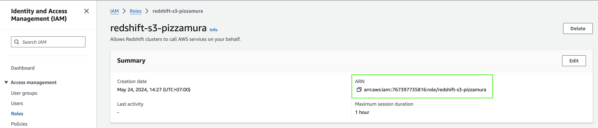
   
    c. For `SCHEMA_NAME`, use `db_pizzamura`. *This is related with Step 5, point 2.c*
   
    d. For `REDSHIFT_HOST`, `REDSHIFT_PORT`, `REDSHIFT_DBNAME`, `REDSHIFT_USER`, go to Amazon Redshift page, choose your cluster. `REDSHIFT_HOST` is in **Node IP addresses** section, copy Public IP address. `REDSHIFT_PORT`, `REDSHIFT_DBNAME`, `REDSHIFT_USER` is in **Database configurations** section.
   
   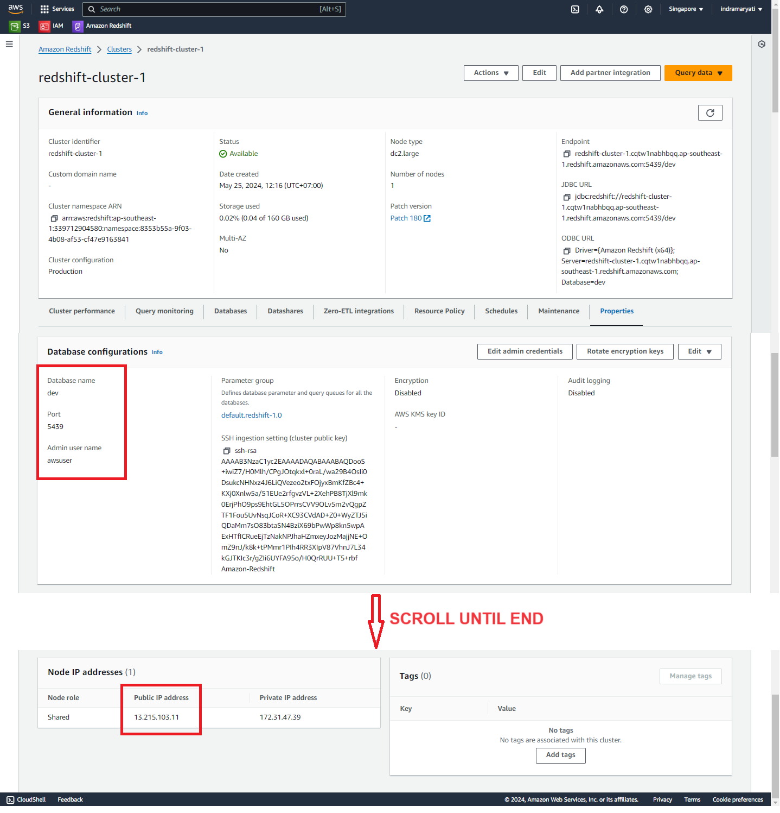
   
    e. For `REDSHIFT_PASSWORD`, type your password when create the Redshift cluster. *This is related with Step 2, point 4.c*

    **Example Bu Indra**
    ```
    export S3_BUCKET_NAME='pizzamura-20210021'
    export IAM_ROLE_ARN='arn:aws:iam::339712904580:role/redshift-s3-pizzamura'
    export SCHEMA_NAME='db_pizzamura'
    
    export REDSHIFT_HOST='13.215.103.11'
    export REDSHIFT_PORT='5439'
    export REDSHIFT_DBNAME='dev'
    export REDSHIFT_USER='awsuser'
    export REDSHIFT_PASSWORD='awsUser-2024'
    ```
    
5. Download [Python Script](./s3-to-redshift.py) and put it in VSCode (same folder with ingestion process). This code is to Execute the `COPY` Command from S3 to Redshift. 
    Run this command:

    ```
    source prod.env && python s3-to-redshift.py
    or
    source prod.env && python3 s3-to-redshift.py
    ```

    The Python script will transfer data from S3 to Redshift and display the log in the terminal.
    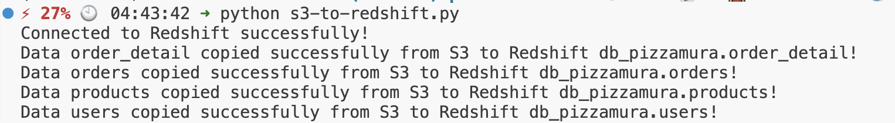


## Step 6: Setup DBT Project to Redshift

### What is dbt?

**dbt (data build tool)** is an open-source tool that enables data analysts and engineers to transform data in their data warehouse more effectively. It focuses on the **T** in ETL (Extract, Transform, Load) by providing a simple SQL-based workflow for transforming raw data into clean, modeled data that can be used for analytics. 

### Why is dbt Essential to Data Engineers?

1. **Efficient Data Transformation**:
   - Data engineers often need to transform raw data into a more usable format for analysis. dbt simplifies this process by providing a framework to write, test, and manage SQL-based transformations.
   
2. **Improved Collaboration**:
   - dbt's integration with version control systems like Git allows multiple data engineers and analysts to collaborate on data transformation projects, track changes, and manage versions efficiently.
   
3. **Data Quality Assurance**:
   - By including testing capabilities, dbt helps data engineers ensure that their transformations are producing correct results, thereby maintaining high data quality.

4. **Faster Development Cycles**:
   - The modular approach of dbt allows for faster development and iteration of data models. Engineers can build and test individual parts of the data pipeline incrementally.
   
5. **Documentation and Data Lineage**:
   - dbt automatically generates documentation and lineage information, making it easier for data engineers to understand and communicate how data is transformed throughout the pipeline.

6. **Scalability and Maintainability**:
   - As data projects grow in complexity, maintaining SQL scripts can become cumbersome. dbt helps organize these scripts into reusable and maintainable components, making it easier to scale data transformation efforts.

### Example Use Case

Consider a scenario where an organization needs to transform raw sales data into a format suitable for generating weekly sales reports. Using dbt, a data engineer can:

1. **Define Models**: Write SQL scripts to clean, aggregate, and join raw sales data.
2. **Manage Dependencies**: Use dbt to manage the order of transformations, ensuring data is processed correctly.
3. **Test Data**: Implement tests to validate that sales data aggregates are accurate.
4. **Generate Documentation**: Automatically generate and update documentation for the transformations.
5. **Collaborate**: Use Git to collaborate with other engineers and analysts on the transformation logic.

### Getting Started with dbt

To get started with dbt, you can follow these basic steps:

1. **Install dbt**: Install dbt using pip or another package manager.
   ```sh
   pip install git dbt-core dbt-redshift
   ```

2. To verify that dbt and the dbt-redshift adapter are installed correctly, run:
    ```sh
    dbt --version
    ```
    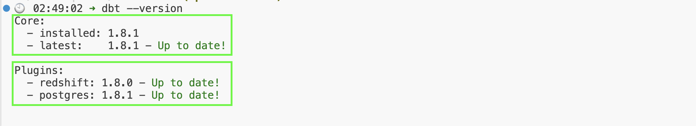

3. **Initialize a dbt Project**: Initialize a new dbt project.
   ```sh
   dbt init [your-new-dir-for-dbt-project]
   ```

4. **Configure the Project**: 
    On the prompt, you'll be asked several informations about the config of database connections. By default, our answers is stored in a `profiles.yml` file that is located in the `~/.dbt/` directory. 
    
    Otherwise, you can override the configuration. Just create or modify this [profiles.yml](./pizzamura_123/profiles.yml) with configuration of your Redshift connection details.
    Replace value of `host`, `user`, `password`, `database`, and `schema` with your actual Redshift cluster endpoint, user, password, database name, and schema.

5. **Run Transformations**: Use dbt commands to debug your dbt connection to Redshift.
   
    ```sh
    dbt debug --project-dir [your-dbt-project-dir] --profiles-dir [your-dbt-project-dir]
    ```
    
    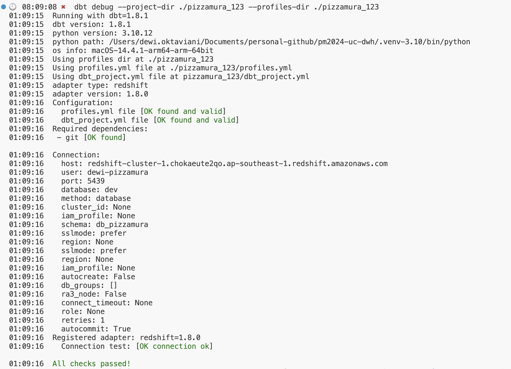

    By incorporating dbt into data pipeline, data engineers can significantly streamline the process of transforming and managing data, leading to more efficient and reliable data pipelines.
