# Transformation Layer on Redshift with dbt

Layering of transformations in Amazon Redshift with dbt (data build tool) is essential for maintaining a well-structured, scalable, and manageable data pipeline. Here's why layering is important:

## 1. **Separation of Concerns**
Layering transformations helps separate different types of transformations, making it easier to manage and understand the data pipeline. Common layers include:

- **Staging Layer:** Raw data ingestion and basic cleaning.
- **Intermediate/Transformation Layer:** Business logic and transformations.
- **Final/Presentation Layer:** Aggregated and formatted data ready for reporting and analysis.

## 2. **Maintainability**
By organizing transformations into layers, each layer can be developed, tested, and maintained independently. This modular approach makes it easier to update or debug specific parts of the data pipeline without affecting the entire system.

## 3. **Scalability**
Layering allows the data pipeline to scale efficiently. As data volume and complexity grow, new layers can be added, and existing ones can be optimized without major overhauls. It also enables distributed development, where different teams can work on different layers simultaneously.

## 4. **Reusability**
Common transformations and logic can be encapsulated in intermediate layers and reused across multiple final models. This reduces redundancy and ensures consistency in how data is processed and transformed.

## 5. **Data Quality and Validation**
By implementing data quality checks and validations at different layers, issues can be detected and addressed early in the pipeline. This ensures that data quality is maintained throughout the entire process.

## 6. **Performance Optimization**
Different layers can be optimized for performance independently. For example, staging tables can be optimized for fast data ingestion, while transformation layers can focus on complex joins and aggregations. This can significantly improve the overall performance of the data pipeline.

## 7. **Documentation and Clarity**
Layered transformations provide a clear and logical structure to the data pipeline, making it easier to document and understand. This is especially important for onboarding new team members and for long-term maintainability.

# Implementation of Layered Transformations in Redshift with dbt


## 1. Installing dbt package

To install the package dependencies for your dbt project, use `dbt deps` command. See [packages.yml](./pizzamura_123/packages.yml) to find out the packages that is gonna be installed. 

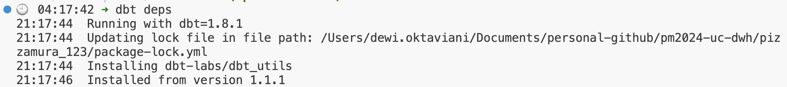

## 2. Defining Source

Defining [sources.yml](./pizzamura_123/models/sources.yml) or any similar `.yml` file in dbt serves several important purposes:

### 1. **Documentation and Clarity**
It documents the external tables or views that your dbt models depend on, providing a clear and structured way to understand the data lineage.

**Example: `sources.yml`**
```yaml
version: 2

sources:
  - name: raw
    description: "Raw data from external systems"
    tables:
      - name: orders
        description: "Orders data from the e-commerce platform"
      - name: customers
        description: "Customer data from the CRM system"
```

### 2. **Testing and Validation**
Defining sources allows you to write tests to validate the data coming from these sources. You can ensure that the raw data meets certain expectations before it is transformed by your dbt models.

**Example: `schema.yml` with Tests**
```yaml
version: 2

sources:
  - name: raw
    tables:
      - name: orders
        tests:
          - not_null:
              column_name: order_id
          - unique:
              column_name: order_id
          - relationships:
              to: ref('customers')
              field: customer_id
              column: customer_id
```

### 3. **Source Freshness**
dbt provides the ability to check the freshness of your sources. By defining sources in `sources.yml`, you can use the `dbt source freshness` command to ensure that your data is up-to-date.

**Example: Source Freshness Check**
```yaml
version: 2

sources:
  - name: raw
    tables:
      - name: orders
        freshness:
          loaded_at_field: load_timestamp
          warn_after: {count: 24, period: hour}
          error_after: {count: 48, period: hour}
```

### 4. **Ease of Use and Maintenance**
When sources are defined in `sources.yml`, they can be easily referenced throughout your dbt models using the `source()` function. This makes your models more readable and maintainable.

**Example: Using `source()` in a Model**
```sql
SELECT
    order_id,
    customer_id,
    order_date,
    amount
FROM
    {{ source('raw', 'orders') }}
```

### 5. **Integration with dbt Documentation**
When you define sources in `sources.yml`, they are automatically included in the dbt documentation site. This provides a comprehensive overview of your data pipeline, including both raw sources and transformed models.

**Generating Documentation**
```sh
dbt docs generate
dbt docs serve
```


## 3. Creating and Running a Model

In dbt, `models` are created in the [models](./pizzamura_123/models/) directory of your dbt project. Each model is essentially a .sql file that contains the SQL code to transform your raw data into the desired format.

Typically, there are steps before creating a model:
- Organize your models to several directories (example: [l1](./pizzamura_123/models/l1/), [l2](./pizzamura_123/models/l2/), [l3](./pizzamura_123/models/l3/))
- Create the model file with `.sql` extension
- Write the SQL code

### 1. **l1/Staging Layer**
This layer performs initial data cleaning, such as: remove duplication.

**Example: [models/l1/stg_orders.sql](./pizzamura_123/models/l1/stg_orders.sql)**

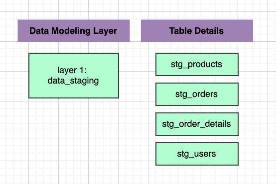

To execute the model, use command `dbt run`. 

It is a command in the data build tool (dbt) that executes the SQL code defined in your dbt models to transform raw data into a structured format that is ready for analysis. When you run dbt run, dbt performs a series of steps to process and materialize the data models defined in your project.

```
# run separately
dbt run --full-refresh --select models/l1/stg_products.sql
dbt run --full-refresh --select models/l1/stg_users.sql
dbt run --full-refresh --select models/l1/stg_orders.sql
dbt run --full-refresh --select models/l1/stg_order_detail.sql
```

```
# run all at once
dbt run --full-refresh --select models/l1+

```


### 2. **l2/Intermediate/Transformation Layer**

This layer involves applying business logic and transformations to the staged data.

**Example: [models/l2/fact_orders_order_detail.sql](./pizzamura_123/models/l2/fact_orders_order_detail.sql)**

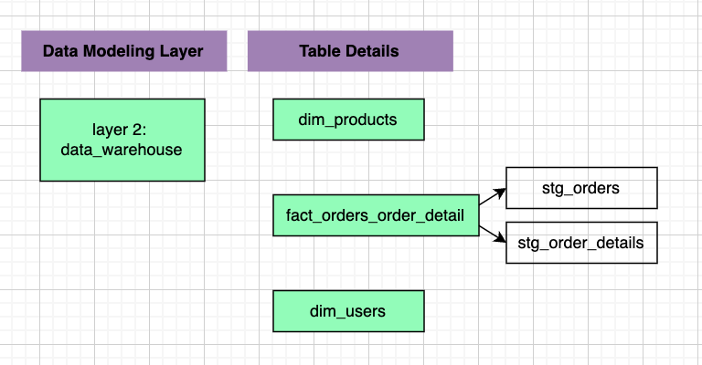


```
dbt run --full-refresh --select models/l2/dim_products.sql
dbt run --full-refresh --select models/l2/dim_users.sql
dbt run --full-refresh --select models/l2/fact_orders_order_detail.sql
dbt run --full-refresh --select models/l2+
```

### 3. **Final/Presentation Layer**
This layer involves creating final, aggregated tables or views that are ready for reporting and analysis.

**Example: [models/l3/mart_daily_sales.sql](./pizzamura_123/models/l3/mart_daily_sales.sql)**

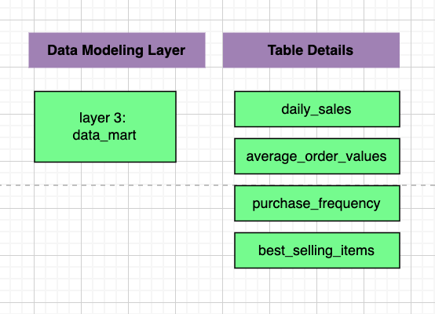

Layering transformations in Redshift with dbt provides a structured, maintainable, and scalable approach to data processing. It separates concerns, enhances maintainability, allows for performance optimization, ensures data quality, and makes the pipeline more understandable and manageable. 

By following best practices for layering, organizations can build robust data pipelines that can adapt to changing data requirements and business needs.

# Data Visualization

Data visualization is the graphical representation of information and data. By using visual elements like charts, graphs, maps, and other visual tools, data visualization provides an accessible way to see and understand trends, outliers, and patterns in data. It helps to convert complex data sets into a visual context, making it easier to comprehend and analyze the information.

In this material, we are going to use Amazon QuickSight for Data Visualization tool. It offers seamless integration with several source tables (Redshift, RDS, etc) within the AWS environment. Meanwhile, it offers flexibility, since it can be accessed from anywhere through a web browser that convenience for a remote and distributed team. 

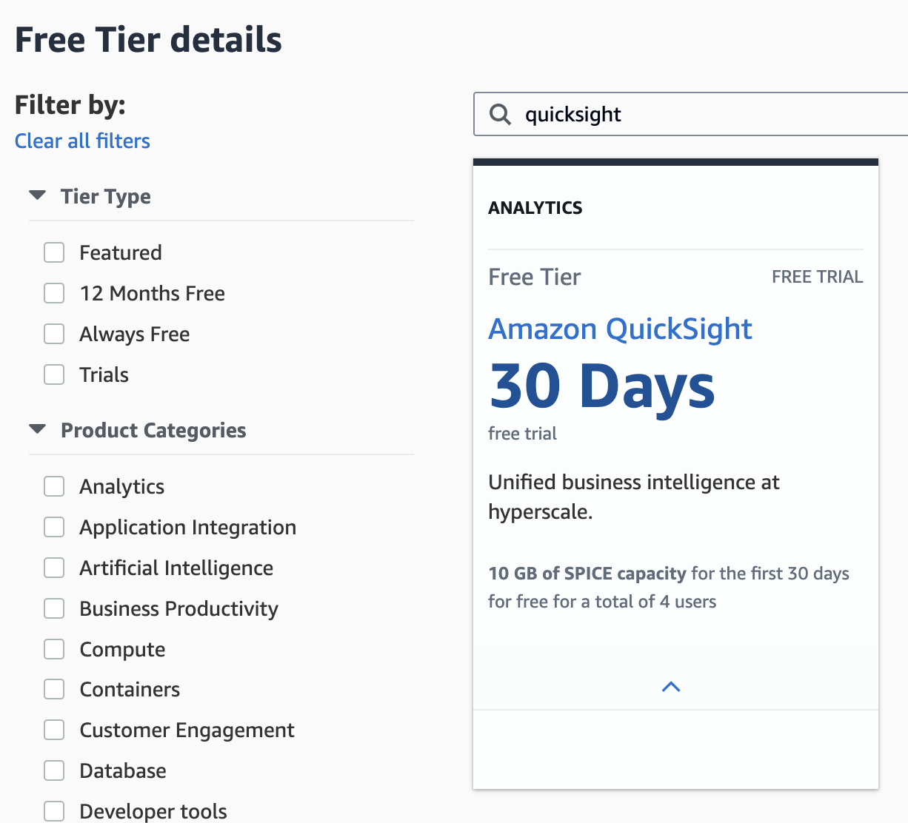

To create an account in AWS QuickSight and start a free trial, follow these steps:

## Step 1: Access QuickSight
1. **Sign In to AWS Management Console:**
   - Go to the [AWS Management Console](https://aws.amazon.com/console/) and sign in with your AWS credentials.

2. **Navigate to QuickSight:**
   - In the AWS Management Console, type "QuickSight" in the search bar and select Amazon QuickSight from the results.
      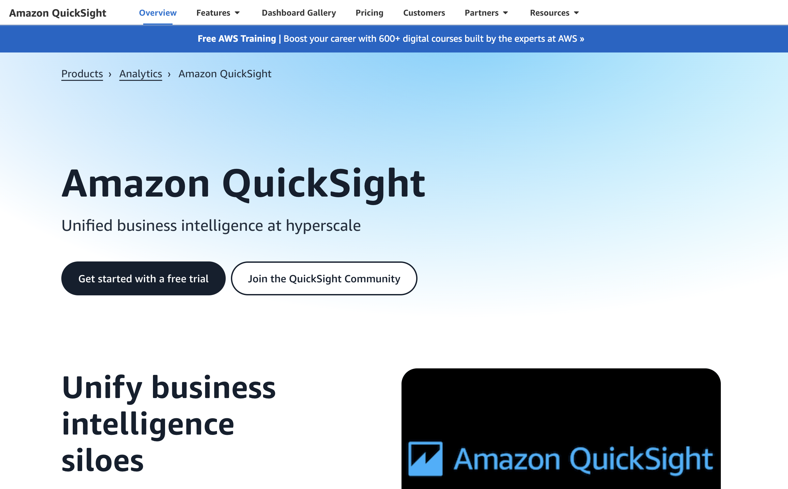

## Step 2: Sign Up for QuickSight Free Trial
1. **Start QuickSight:**
   - Click on the “Sign up for QuickSight” button.
      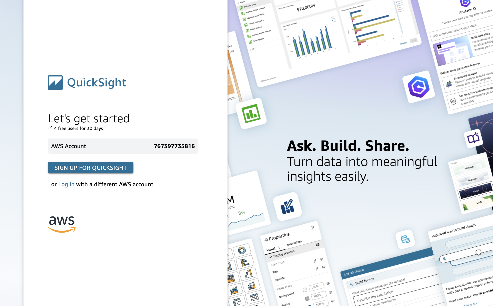


2. **Fill in User Details:**
   - Provide the required information, such as your QuickSight account name and notification email address.
   - Choose your region (where you want QuickSight to be hosted).

   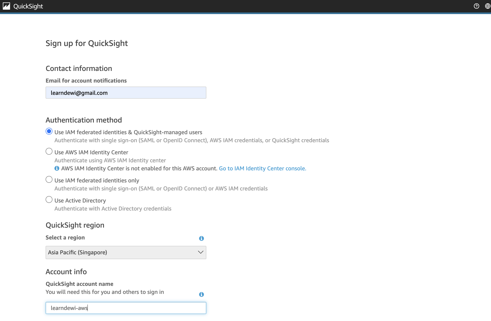
   

4. **Create QuickSight Account:**
   - Uncheck the optional add-on (so that you will be on a free trial) and click “Finish” to create your QuickSight account.

   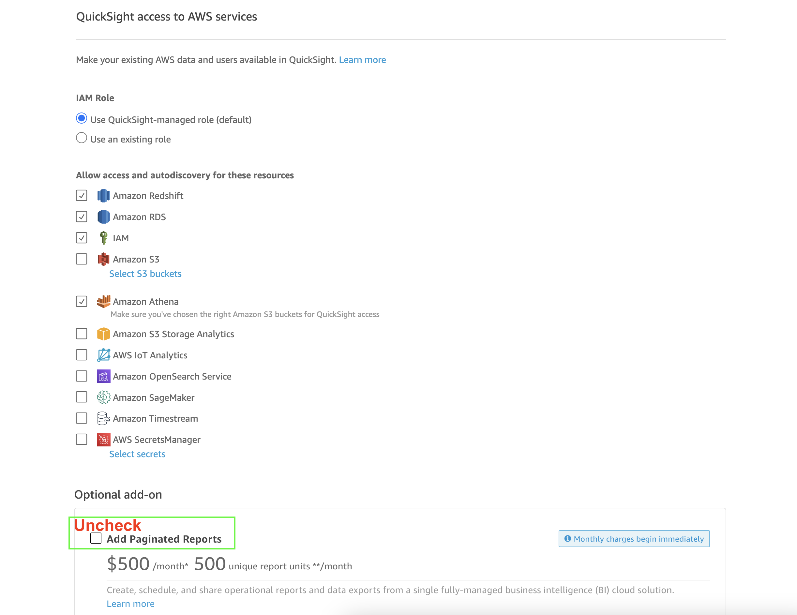

   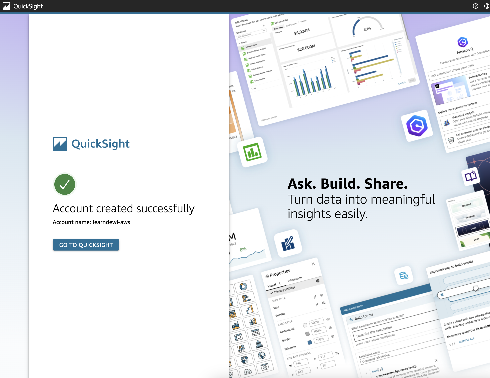


## Step 3: Explore QuickSight
1. **Initial Setup:**
   - After account creation, you can start using QuickSight immediately.
   - You will be taken to the QuickSight dashboard.

2. **Connect Data Sources:**
   - Click on “Manage Data” to connect to various data sources like Amazon S3, Redshift, RDS, and more.

   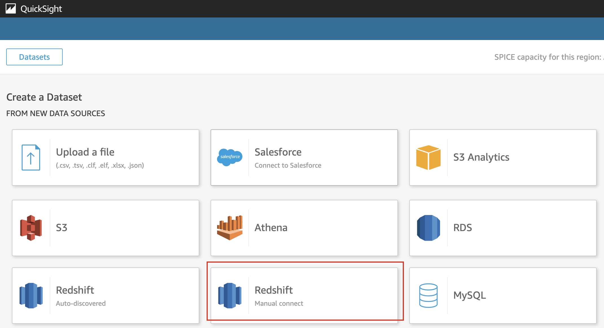

3. **Connect to Redshift**

   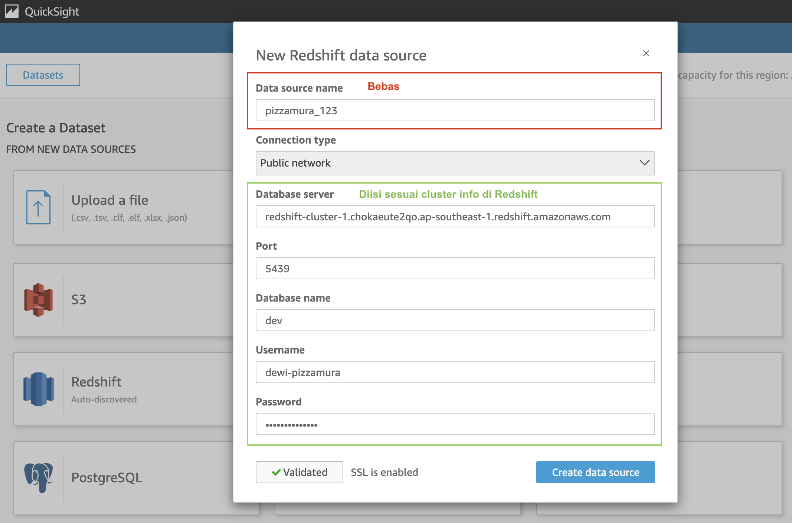

4. **Connect to DataMart Model**

   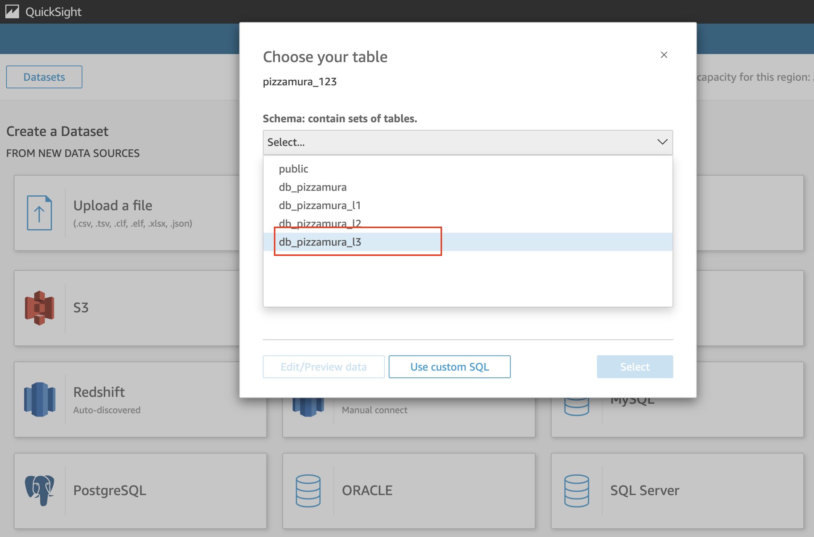

   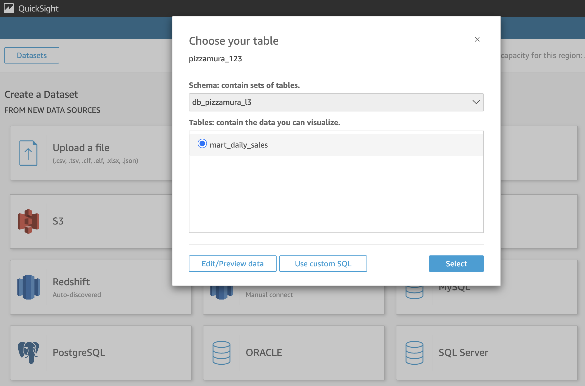

   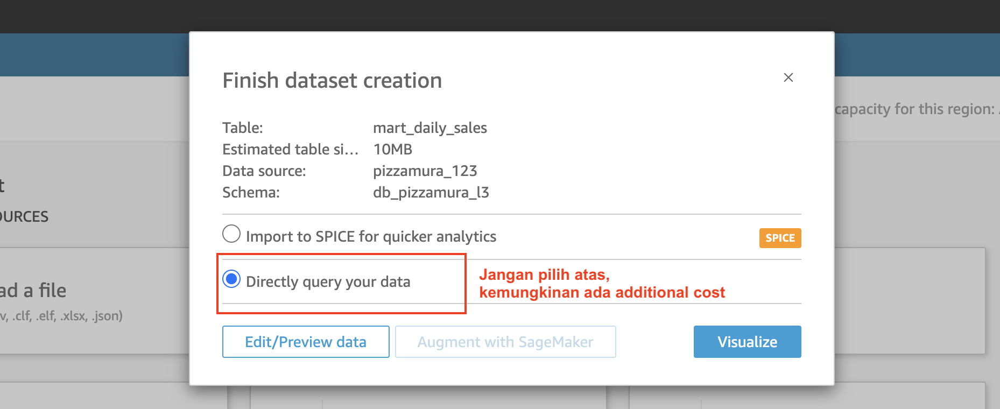


5. **Create Analysis:**
   - Click on “New Analysis” to start creating visualizations and analyses using your data.

   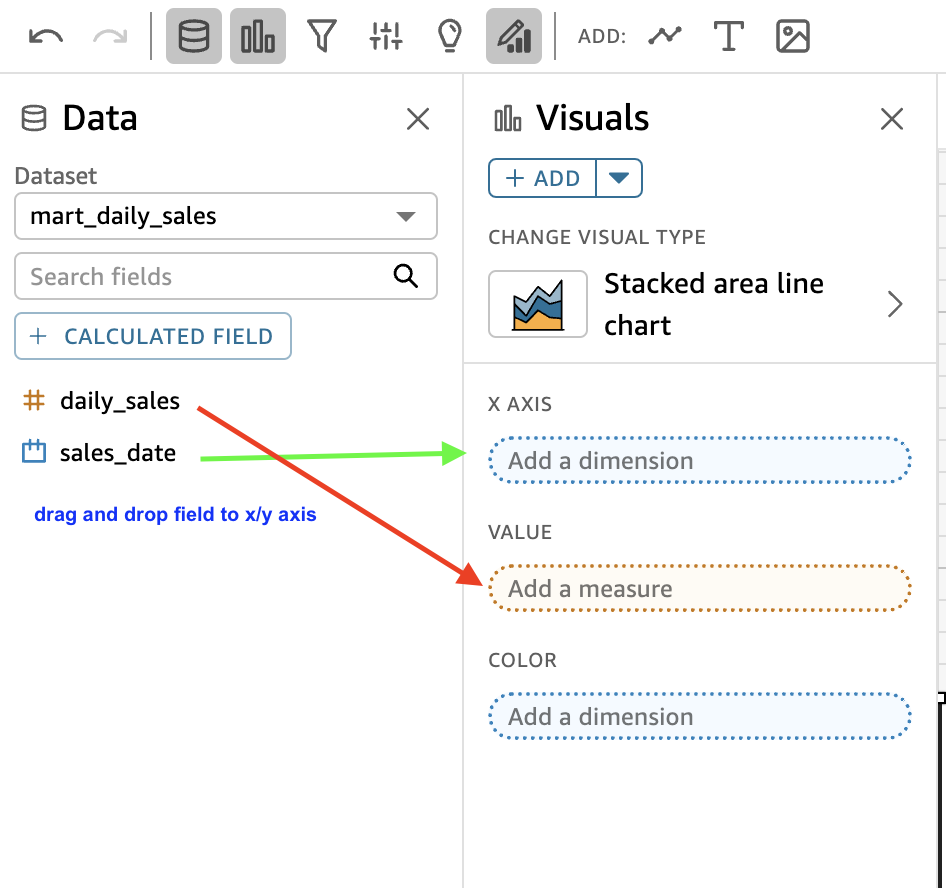
